<div align="center">

<h1>WildIcon</h1>

<h3>Generating the Wild: Individual-Consistent Image-to-Video Generation for Wildlife</h3>

<a href="https://openreview.net/profile?id=~Yuzhuo_Li1">Yuzhuo Li</a>&emsp;
<a href="https://openreview.net/profile?id=~Di_Zhao4">Di Zhao</a>&emsp;
<a href="https://openreview.net/profile?id=~Xinyu_Zhang3">Xinyu Zhang</a>&emsp;
<a href="https://openreview.net/profile?id=~Daniel_Wilson4">Daniel Wilson</a>&emsp;
<a href="https://openreview.net/profile?id=~Yun_Sing_Koh2">Yun Sing Koh</a>

School of Computer Science, University of Auckland

<a href="https://openreview.net/forum?id=Twfrs5sTBH"></a>
<a href="annotations/"></a>
<a href="LICENSE"></a>
<a href="annotations/LICENSE"></a>

</div>

<br>

WildIcon studies individual-consistent image-to-video (I2V) generation for wildlife. Given one reference image and a motion prompt, the goal is to synthesize temporally coherent videos that preserve the same wildlife individual, including fine-grained identity cues such as texture, stripe boundaries, spot configurations, and local contour transitions.

<p align="center">
  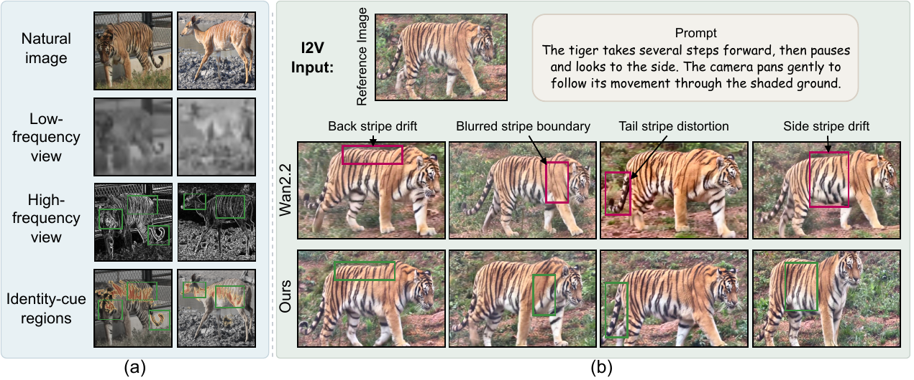
  <br>
  <em><strong>Figure 1.</strong> Frequency-aware identity preservation in wildlife I2V generation. (a) Low-frequency views preserve coarse body structure but suppress fine-grained identity cues, whereas high-frequency views reveal local identity-discriminative details. (b) Given the same reference image and prompt, Wan2.2 blurs or alters identity-critical stripe patterns across frames, while WildIcon better preserves these fine-grained cues for same-individual consistency.</em>
</p>

## ✨ Highlights

- **WildIcon**: a high-frequency-guided I2V framework built on a frozen Wan2.2 backbone with lightweight identity adaptation.
- **Foreground-filtered identity cues**: the reference foreground and its high-frequency residual are encoded as complementary identity tokens.
- **Selective cross-attention conditioning**: identity tokens are concatenated with text tokens and injected into selected middle and late DiT blocks.
- **Identity regularization**: training supports the paper's frozen feature-space identity loss, using sampled decoded frames and a frozen identity encoder.
- **WildlifeVid**: a wildlife-centric video dataset with individual identity labels and standardized prompts for individual-consistent I2V.
- **Downstream utility**: generated videos are evaluated for video quality, subject consistency, and usefulness for animal re-identification (ReID) training.

## Method Overview

<p align="center">
  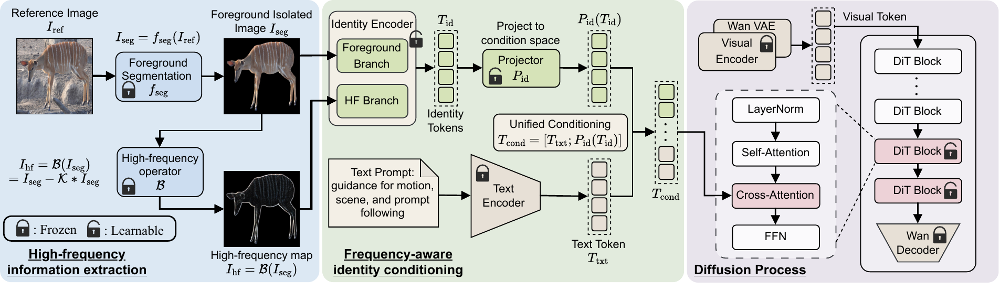
  <br>
  <em><strong>Figure 2.</strong> Overview of the WildIcon framework.</em>
</p>

WildIcon augments Wan2.2-I2V with a frequency-aware identity branch. For a reference image `I_ref`, the framework first obtains a foreground-isolated image `I_seg` and computes a high-frequency residual map `I_hf`. A frozen DINO visual encoder processes the foreground image, while a lightweight trainable high-frequency encoder processes the residual map. The fused identity tokens are projected into the Wan conditioning space and concatenated with text tokens for selected cross-attention blocks.

This design keeps the base video generator responsible for layout, semantic content, and motion, while the identity branch supplies fine-grained wildlife-specific cues that are often diluted by generic I2V conditioning. The training entry point also implements the paper's identity loss:

```text
L = L_FM + lambda_id * L_id
```

where `L_id` compares sampled decoded frames with the reference image in a frozen identity-feature space. The released training scripts expose this through `WILDICON_IDENTITY_LOSS_WEIGHT`, `WILDICON_IDENTITY_LOSS_MODEL`, and `WILDICON_IDENTITY_LOSS_NUM_FRAMES`.

## Repository Layout

```text
WildIcon/
├── 📂 framework/                 # DiffSynth-Studio overlay for WildIcon
│   ├── 📂 diffsynth/             # Modified / added DiffSynth modules
│   ├── 📂 examples/              # Training and inference entry points
│   └── 📄 UPSTREAM_REVISION      # DiffSynth-Studio commit the overlay targets
├── 📂 annotations/               # WildlifeVid annotations (no videos or frames)
│   ├── 📄 WildlifeVid.csv        # One row per clip
│   ├── 📂 source/                # Per-source tables that WildlifeVid.csv is merged from
│   └── 📄 LICENSE                # CC BY 4.0
├── 📂 dataset/                   # Annotation checks, local training metadata, curation scripts
├── 📂 evaluation/                # Paper metrics and FVD
├── 📂 assets/                    # README figures, badge and video examples
├── 📂 tools/                     # Overlay installer
├── 📄 requirements.txt           # Extra Python dependencies
└── 📄 README.md
```

## Installation

1. Clone DiffSynth-Studio at the commit the overlay was prepared against, and install it.

```bash
git clone https://github.com/modelscope/DiffSynth-Studio.git
cd DiffSynth-Studio
git checkout ba0626e38f7b8c7908e4f6f597d38282ebba0d38
pip install -e .
```

2. Apply the WildIcon overlay. It copies `framework/diffsynth/` and `framework/examples/` into the checkout (requires `rsync`).

```bash
bash /path/to/WildIcon/tools/apply_overlay.sh /path/to/DiffSynth-Studio
```

3. Install the extra dependencies used by the training, dataset and evaluation scripts.

```bash
pip install -r /path/to/WildIcon/requirements.txt
```

4. Download [Wan2.2-I2V-A14B](https://huggingface.co/Wan-AI/Wan2.2-I2V-A14B) and the DINOv3 ViT-L/16 identity encoder ([facebook/dinov3-vitl16-pretrain-lvd1689m](https://huggingface.co/facebook/dinov3-vitl16-pretrain-lvd1689m)). The scripts load both from local files. They read the following from `LOCAL_MODEL_ROOT`:

```text
Wan2.2-I2V-A14B/
├── 📂 high_noise_model/          # diffusion_pytorch_model-*.safetensors
├── 📂 low_noise_model/           # diffusion_pytorch_model-*.safetensors
├── 📂 google/umt5-xxl/           # tokenizer
├── 📄 models_t5_umt5-xxl-enc-bf16.pth
└── 📄 Wan2.1_VAE.pth
```

## WildlifeVid

WildlifeVid is curated for wildlife individual-consistent I2V training and evaluation. It contains 37,441 single-subject video clips, 16,524 individual identities, and 135 species from four public sources. Each retained clip is paired with an individual identity label and a standardized prompt.

<p align="center">
  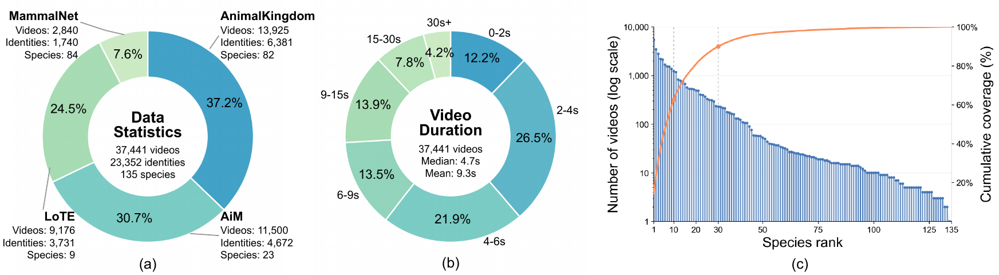
  <br>
  <em><strong>Figure 3.</strong> Overview statistics of WildlifeVid.</em>
</p>

Source composition:

| Source | Videos | Identities | Species |
| --- | ---: | ---: | ---: |
| [AiM](https://github.com/briannlongzhao/Animal-in-Motion) | 11,500 | 4,672 | 23 |
| [AnimalKingdom](https://github.com/sutdcv/Animal-Kingdom) | 13,925 | 6,381 | 82 |
| [LoTE-Animal](https://lote-animal.github.io/) | 9,176 | 3,731 | 9 |
| [MammalNet](https://mammal-net.github.io/) | 2,840 | 1,740 | 84 |

### Annotations

The annotations are in [`annotations/WildlifeVid.csv`](annotations/WildlifeVid.csv), one row per clip. We do not redistribute the source videos or raw frames; obtain them from the original datasets under their terms of use.

<details>
<summary><b>Column reference</b></summary>
<br>

| Column | Content |
| --- | --- |
| `video` | Clip path, relative to the local data root |
| `prompt` | Standardized text prompt |
| `dataset` | Source dataset: `AiM`, `AnimalKingdom`, `LoTE` or `MammalNet` |
| `species`, `species_id` | Species label as named in the source (e.g. `bear` in AiM, `Bear` elsewhere) |
| `track_id` | Clip identifier in the source dataset |
| `identity`, `identity_str` | Identity label within the species |
| `global_identity` | Identity label across WildlifeVid |
| `reference_image` | Reference frame path, relative to the local data root |
| `segmented_image` | Empty: foreground images are prepared locally (see [Training](#training)) |
| `segment_prompt`, `segment_status`, `segment_score` | Record of our local foreground-extraction pass; the foreground images themselves are not released |
| `source_*` | The row's species and identity ids in its per-source table |

</details>

Species labels keep each source's naming. Merging case variants and three synonyms (`hippo`/`hippopotamus`, `racoon`/`raccoon`, `rhino`/`rhinoceros`) gives the 135 species above.

`annotations/source/` holds the four per-source tables. [`dataset/scripts/merge_wildlifevid_metadata.py`](dataset/scripts/merge_wildlifevid_metadata.py) rebuilds `WildlifeVid.csv` from them. [`dataset/validate_annotations.py`](dataset/validate_annotations.py) checks the table and prints the counts above. The remaining scripts in `dataset/scripts/` cover initial identity labeling, same-identity clip clustering, species normalization, and duration probing.

## Training

Training reads the source videos, reference frames and foreground images from a local data root. The foreground images are not distributed. Produce one per reference image, i.e. the reference image with the background removed. Then write a local training table that points to them:

```bash
python /path/to/WildIcon/dataset/prepare_local_metadata.py \
  --input_csv /path/to/WildIcon/annotations/WildlifeVid.csv \
  --output_csv /path/to/WildlifeVid/WildlifeVid.local.csv \
  --data_root /path/to/WildlifeVid \
  --foreground_root /path/to/foregrounds
```

`--foreground_root` expects a directory that mirrors the relative `reference_image` paths. Alternatively, `--segmentation_csv` takes a `video,segmented_image` mapping. The script writes nothing if any video, reference or foreground file is missing.

The main paper training path uses Wan2.2-I2V-A14B with external foregrounds, a DINOv3 identity encoder, foreground-filtered high-frequency tokens, and the frozen feature-space identity loss. The launcher defaults follow the paper's implementation details: 81 frames at 832×480, Adam with learning rate 1e-4, and a per-GPU batch size of 1 with gradient accumulation over 4 steps.

```bash
cd /path/to/DiffSynth-Studio

export DATASET_BASE_PATH=/path/to/WildlifeVid
export DATASET_METADATA_PATH=/path/to/WildlifeVid/WildlifeVid.local.csv
export LOCAL_MODEL_ROOT=/path/to/Wan2.2-I2V-A14B
export WILDICON_DINO_MODEL=/path/to/dinov3-vitl16-pretrain-lvd1689m
export WILDICON_IDENTITY_LOSS_MODEL=/path/to/frozen_identity_encoder
export WILDICON_IDENTITY_LOSS_WEIGHT=0.05
export TRAIN_STAGE=both

bash examples/wanvideo/model_training/full/Wan2.2-I2V-A14B-WildIcon-WildlifeVid.sh
```

`TRAIN_STAGE` is `high_noise`, `low_noise`, or `both`, which trains the high-noise stage and then starts the low-noise stage from its latest checkpoint.

For the lighter TI2V-5B variant:

```bash
cd /path/to/DiffSynth-Studio

export DATASET_BASE_PATH=/path/to/WildlifeVid
export DATASET_METADATA_PATH=/path/to/WildlifeVid/WildlifeVid.local.csv
export LOCAL_MODEL_ROOT=/path/to/Wan2.2-TI2V-5B

bash examples/wanvideo/model_training/full/Wan2.2-TI2V-5B-WildIcon-WildlifeVid.sh
```

Important knobs:

- `--wildicon_enabled`: attaches the identity branch.
- `--wildicon_segmentor_type external`: expects `segmented_image` in the metadata CSV.
- `--wildicon_encoder_type dinov3`: uses a DINOv3 visual backbone with high-frequency identity tokens.
- `--wildicon_selected_block_ids`: selects the DiT blocks that receive identity conditioning.
- `--wildicon_identity_loss_weight`: enables the frozen feature-space identity loss when greater than `0`.

## Inference

Run the inference script from the DiffSynth-Studio root. `--prompt_json` maps each reference image file name to a list of prompts, e.g. `{"tiger_01.png": ["The tiger walks slowly forward.", "..."]}`. The foreground images in `--segmented_dir` use the same file names as the references.

```bash
python examples/wanvideo/model_training/validate_full/Wan2.2-I2V-A14B-WildIcon-WildlifeEval.py \
  --stage_mode low_only \
  --low_checkpoint_dir /path/to/low_noise_checkpoints \
  --reference_dir /path/to/reference_images \
  --segmented_dir /path/to/segmented_images \
  --prompt_json /path/to/prompts.json \
  --local_model_root /path/to/Wan2.2-I2V-A14B \
  --output_root /path/to/generated
```

Each run loads one adapter checkpoint at a time. `--stage_mode` selects which checkpoint directory is rendered: `low_only` (default), `high_only`, or `both`. Videos are written to `<output_root>/<stage>/<checkpoint>/generated_videos/` as 81 frames at 832×480 and 16 FPS. A `generation_manifest.csv` next to them records the exact reference image and prompt of each video. `Wan2.2-TI2V-5B-WildIcon-WildlifeEval.py` in the same directory is the TI2V-5B counterpart.

## Evaluation

`evaluation/evaluate_generated_videos.py` computes the per-video metrics from a generation manifest:

```bash
python /path/to/WildIcon/evaluation/evaluate_generated_videos.py \
  --manifest /path/to/generated/low_noise/<checkpoint>/generation_manifest.csv \
  --output_dir /path/to/eval_outputs \
  --compute_i2v_background \
  --compute_motion_smoothness \
  --amt_repo_dir /path/to/AMT \
  --amt_config /path/to/AMT/cfgs/AMT-S.yaml \
  --amt_ckpt /path/to/amt-s.pth
```

| Paper metric | Implementation |
| --- | --- |
| I2V Subject | DINOv3 similarity between the reference image and sampled frames |
| I2V Background | [DreamSim](https://github.com/ssundaram21/dreamsim) similarity between the reference image and sampled frames (`--compute_i2v_background`, `pip install dreamsim`) |
| Subject Consistency | DINOv3 similarity between consecutive sampled frames |
| Text Relevance | CLIPScore between the prompt and sampled frames |
| Motion Smoothness | [AMT](https://github.com/MCG-NKU/AMT) frame-interpolation score (`--compute_motion_smoothness`, AMT-S checkpoint) |

Results are written as `per_video_metrics.csv` and `summary.json`. Without a manifest, `--video_dir`, `--reference_dir` and `--prompts_json` match videos named `<reference>__pNN__...mp4` with 1-based prompt numbers.

FVD is computed between a directory of real videos and one or more directories of generated videos. The features come from a Kinetics-pretrained R3D-18 network:

```bash
python /path/to/WildIcon/evaluation/compute_fvd.py \
  --real_dir /path/to/real_videos \
  --gen_dirs /path/to/generated/low_noise/<checkpoint>/generated_videos \
  --gen_names WildIcon \
  --output_json /path/to/fvd.json
```

## Qualitative Examples

<p align="center">
  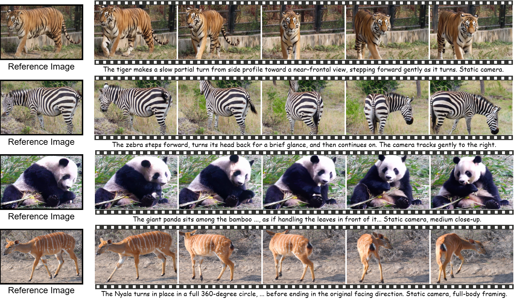
  <br>
  <em><strong>Figure 4.</strong> Individual-consistent video generation examples.</em>
</p>

Reference images and GIF previews of WildIcon generations are shown below. Open the MP4 links for the full videos.

<table>
  <tr>
    <th>Species</th>
    <th>Reference</th>
    <th>GIF preview</th>
    <th>Full MP4</th>
  </tr>
  <tr>
    <td>Bear</td>
    <td>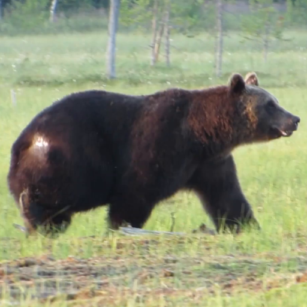</td>
    <td>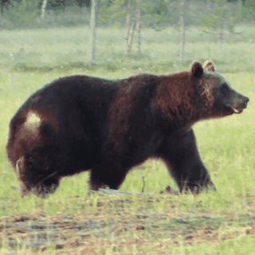</td>
    <td><a href="assets/examples/bear_01.mp4">bear_01.mp4</a></td>
  </tr>
  <tr>
    <td>Elephant</td>
    <td>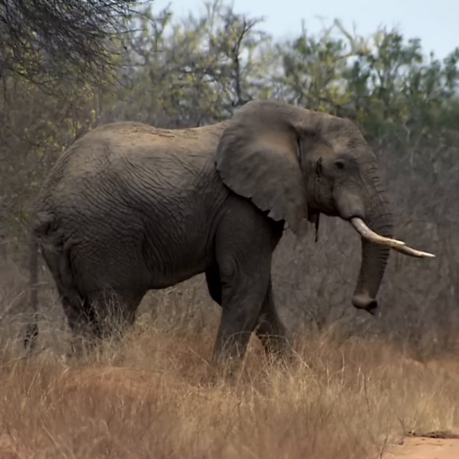</td>
    <td>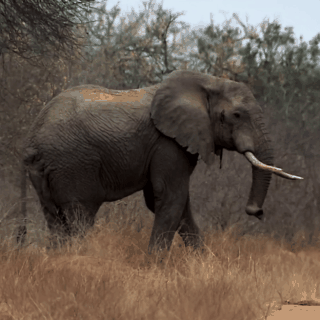</td>
    <td><a href="assets/examples/elephant_01.mp4">elephant_01.mp4</a></td>
  </tr>
  <tr>
    <td>Elephant</td>
    <td>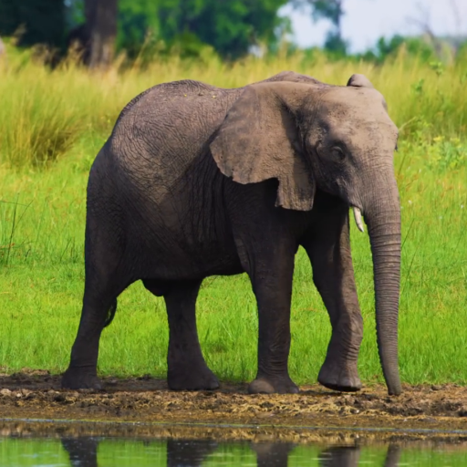</td>
    <td>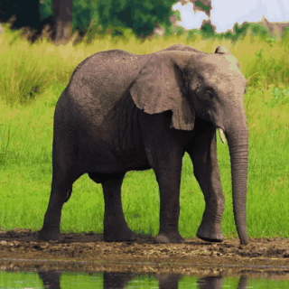</td>
    <td><a href="assets/examples/elephant_02.mp4">elephant_02.mp4</a></td>
  </tr>
  <tr>
    <td>Hippo</td>
    <td>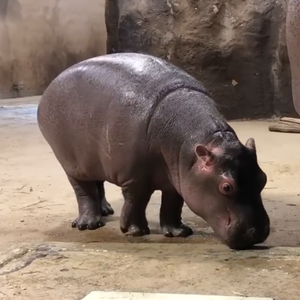</td>
    <td>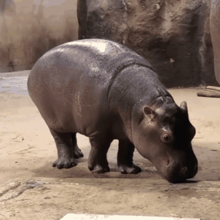</td>
    <td><a href="assets/examples/hippo_01.mp4">hippo_01.mp4</a></td>
  </tr>
  <tr>
    <td>Hyena</td>
    <td>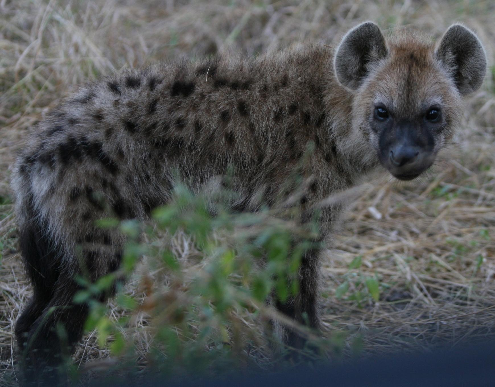</td>
    <td>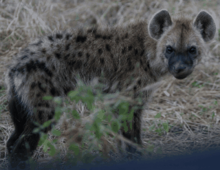</td>
    <td><a href="assets/examples/hyena_01.mp4">hyena_01.mp4</a></td>
  </tr>
  <tr>
    <td>Rabbit</td>
    <td>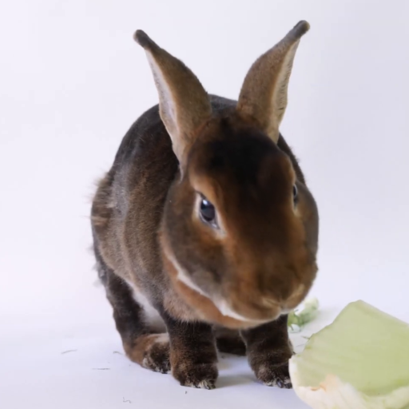</td>
    <td>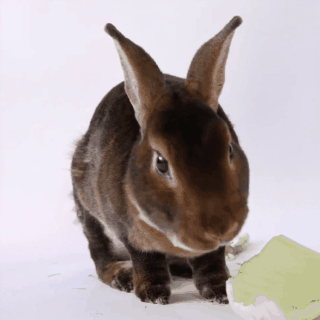</td>
    <td><a href="assets/examples/rabbit_01.mp4">rabbit_01.mp4</a></td>
  </tr>
  <tr>
    <td>Raccoon</td>
    <td>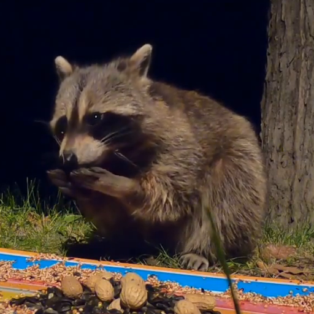</td>
    <td>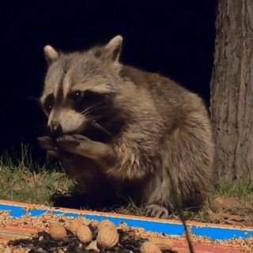</td>
    <td><a href="assets/examples/raccoon_01.mp4">raccoon_01.mp4</a></td>
  </tr>
  <tr>
    <td>Sheep</td>
    <td>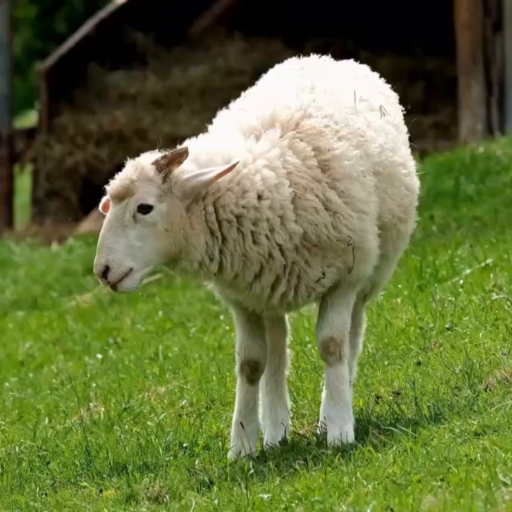</td>
    <td></td>
    <td><a href="assets/examples/sheep_01.mp4">sheep_01.mp4</a></td>
  </tr>
  <tr>
    <td>Tiger</td>
    <td>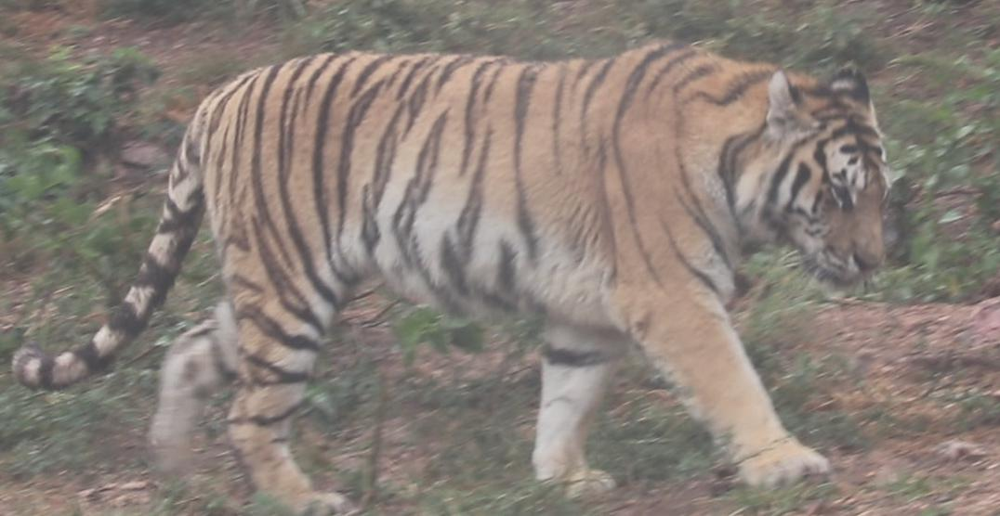</td>
    <td></td>
    <td><a href="assets/examples/tiger_01.mp4">tiger_01.mp4</a></td>
  </tr>
</table>

## License

The code is released under the [Apache License 2.0](LICENSE). The WildlifeVid annotations, prompts and statistics that we created are released under [CC BY 4.0](annotations/LICENSE). The source videos remain under the terms of their original datasets.

## Acknowledgements

WildIcon code repo is built on [DiffSynth-Studio](https://github.com/modelscope/DiffSynth-Studio) and [Wan2.2](https://github.com/Wan-Video/Wan2.2). We thank the DiffSynth-Studio and Wan2.2 open-source communities for releasing the training and inference infrastructure that makes this research code possible. We also thank the authors of [DINOv3](https://github.com/facebookresearch/dinov3), [DreamSim](https://github.com/ssundaram21/dreamsim), [AMT](https://github.com/MCG-NKU/AMT) and [CLIP](https://github.com/openai/CLIP), which we use for identity encoding and evaluation, and the creators of [Animal-in-Motion](https://github.com/briannlongzhao/Animal-in-Motion), [Animal Kingdom](https://github.com/sutdcv/Animal-Kingdom), [LoTE-Animal](https://lote-animal.github.io/) and [MammalNet](https://mammal-net.github.io/), the source datasets of WildlifeVid.

## Citation

If you find WildIcon or WildlifeVid useful in your research, please cite:

```bibtex
@inproceedings{li2026wildicon,
  title     = {Generating the Wild: Individual-Consistent Image-to-Video Generation for Wildlife},
  author    = {Li, Yuzhuo and Zhao, Di and Zhang, Xinyu and Wilson, Daniel and Koh, Yun Sing},
  booktitle = {Advances in Neural Information Processing Systems},
  year      = {2026}
}
```
